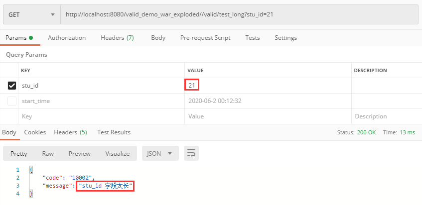
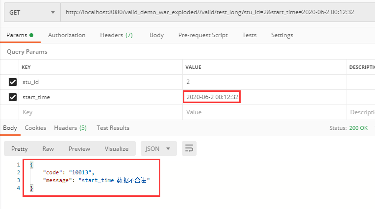

#### 场景
@Valid注解大部分说明都是注解在实体属性上，然后方法入参是实体，之后在方法入参上@Valid。
但是现在项目中，入参统一用String类型去接收，不定义实体。然后对参数进行
一一校验。校验通过之后在统一封装到实体中。

#### 解决
通过springAOP拦截使用@Valid注解的Controller方法，之后在去校验。

##### 20200612更新
demo举例实现AOP切@Valid注解的Controller方法，进行参数校验。
- stu_id不合法

- start_time不合法
